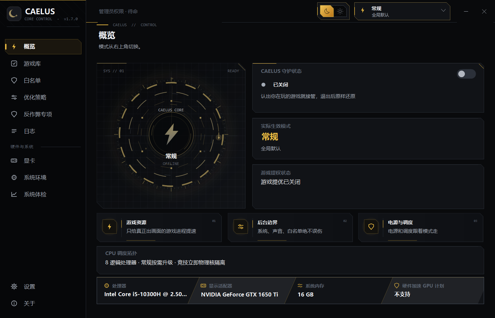
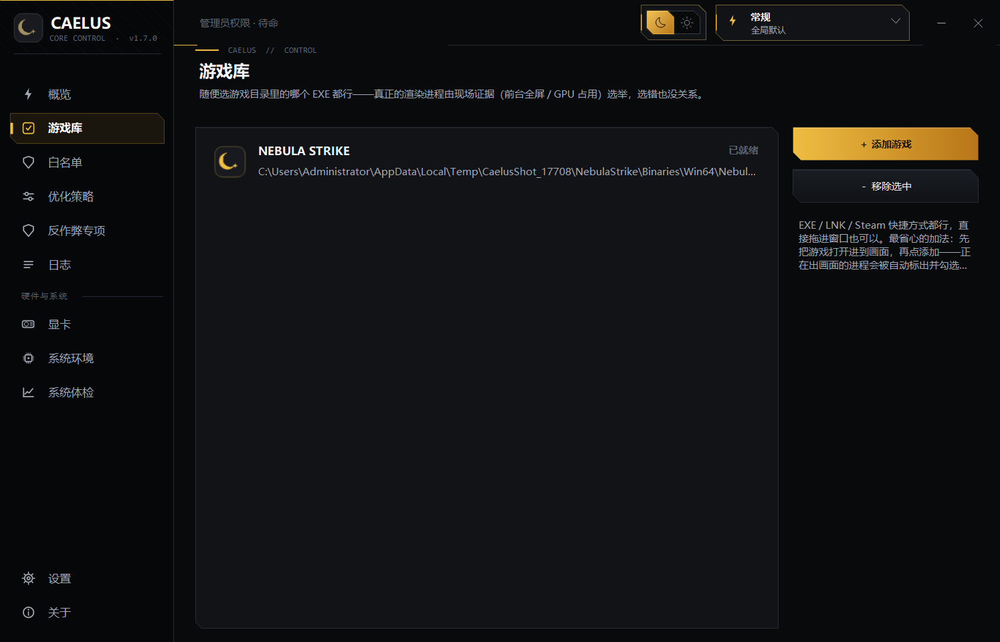
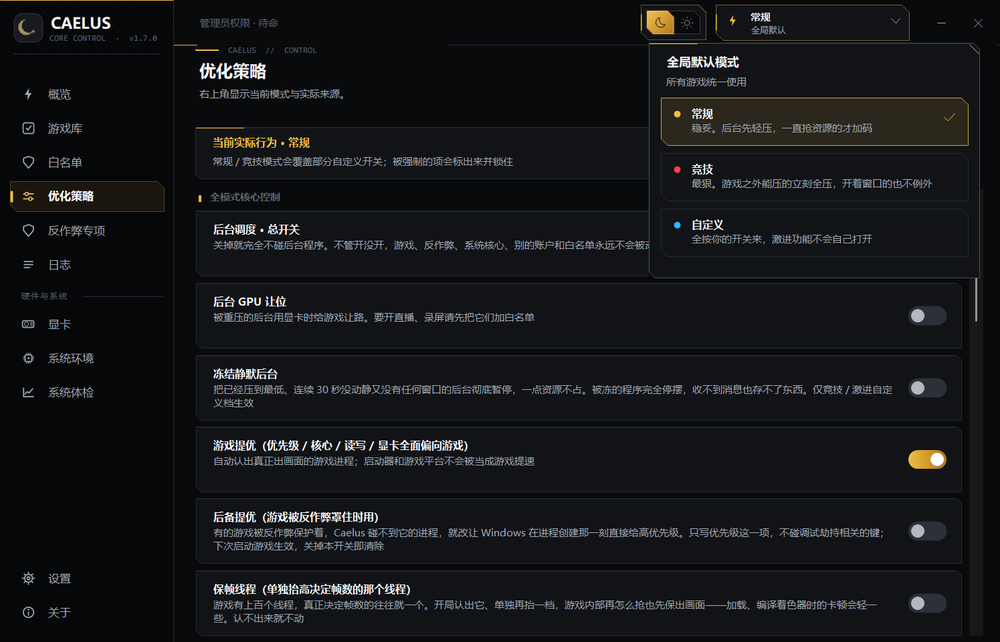
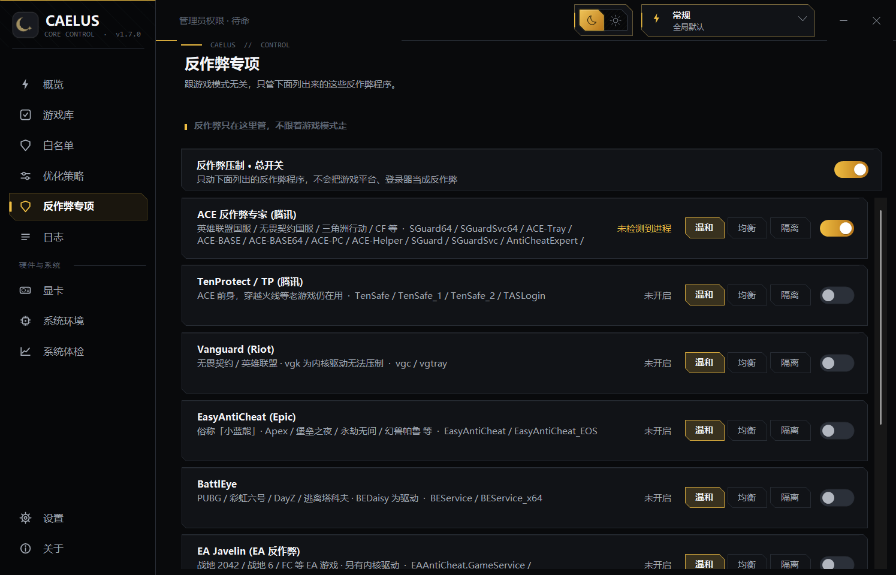
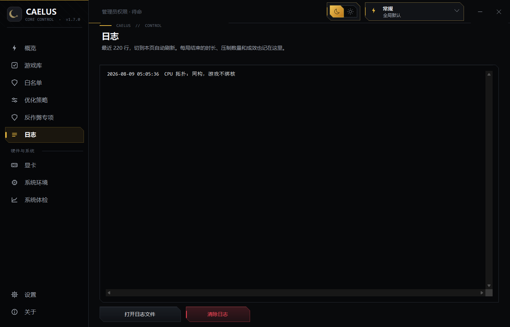
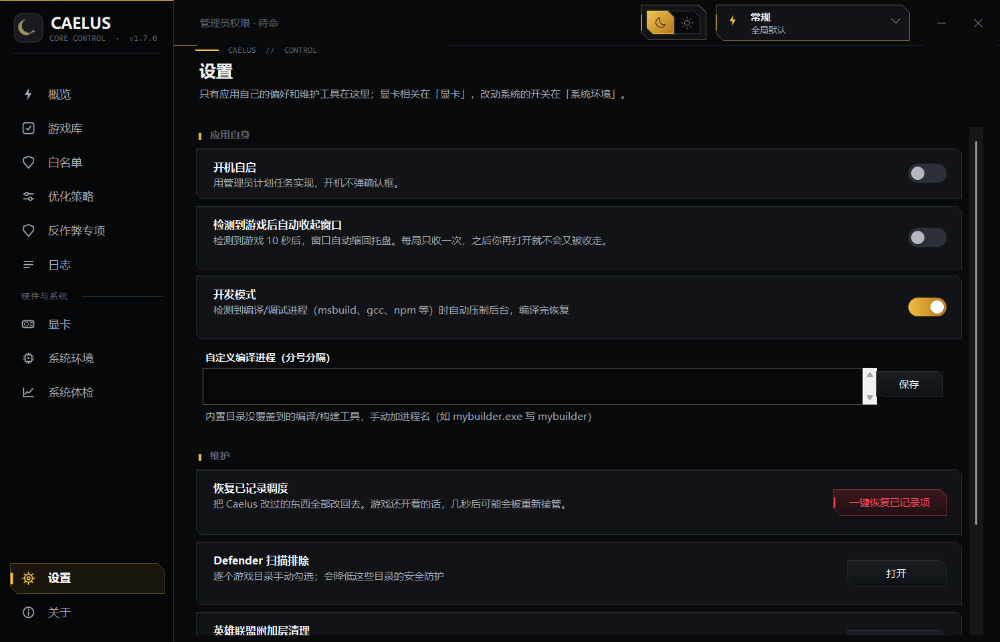

<div align="center">


# CAELUS

**为游戏腾出天空** —— 打游戏时把系统资源让给游戏的 Windows 小工具。

[](https://github.com/wxj-1019/Caelus)
[](https://github.com/wxj-1019/Caelus)
[](https://github.com/wxj-1019/Caelus)
[](https://github.com/wxj-1019/Caelus)
[](https://github.com/wxj-1019/Caelus)
[](LICENSE)

**简体中文** · [English](README.en.md) · [日本語](README.ja.md)

</div>

---

## 它到底能不能提升性能？

Caelus 不是给电脑"凭空变出性能"的，也不会让 CPU、显卡突破原本的上限。

它做的事情更像是：**你打游戏的时候，把被后台程序、更新任务、反作弊占走的那部分性能还给游戏。** 游戏优先拿 CPU、硬盘和调度资源，没在用的后台先让一让；游戏退出后再还原回去。

所以，如果你的电脑后台开得多、CPU 或磁盘经常被抢，Caelus 更可能改善卡顿、帧时间和 1% Low，平均帧数也可能随之好一点。如果系统本来就很干净，或者游戏已经完全跑满显卡，它通常不会带来明显提升。设置得过于激进，反而可能让游戏、语音软件或反作弊出现兼容问题——竞技模式默认就是最激进的那一档，选它就是接受这个取舍。

一句话概括：**Caelus 的目标不是创造新的性能，而是让电脑原有的性能在打游戏时更少被干扰。** 实际效果请以同一游戏、同一场景下的开关对比为准。

---

## Caelus 是谁

> 罗马神话里，Caelus 是天空之神。游戏起飞时，它为你拨开后台的云——把被占走的天空让出来，落地后再还给它们。

| | |
|---|---|
| 🎯 **认游戏** | 不只是进程名：入口、安装目录关系、窗口与前台状态一起判断；启动器换壳、临时目录真身都能认回来 |
| ⚖️ **三档策略** | 常规（轻压）/ 竞技（全压）/ 自定义（逐项选），反作弊与对局宿主无条件豁免 |
| 🔄 **恢复靠记录** | 每个被动过的进程都存下动之前的状态（PID + 创建时间校验），退出还原；崩溃了下次启动接着还原 |
| 🔒 **纯本地** | 不装服务、不上传数据、不注入游戏、不改游戏内存与文件；写过的设置逐项读回核对 |
| 🧪 **实测说话** | 内置 225 项自测 + 真机台架数据：压制收益、中断分布、NVIDIA 写入全部有数据支撑 |

---

## 核心能力

### 🎮 目标库与识别

- EXE / LNK / Steam 快捷方式，支持拖放和一键扫描已装游戏（Steam / Epic / GOG / 育碧 / Riot / WeGame / 战网 / Xbox / 微软商店，加速器不会被当成游戏推荐）
- 自动认出游戏本体：启动器不会长期霸占保护；换目录跑的真身、同目录的 Launcher 进程（如骑马与砍杀2）、启动器换壳（如 LOL）都有对应识别办法
- 切出前台、最小化不丢保护
- 启动器换壳启动的游戏确认一次后记住游戏本体，下次直接认；记住的路径失效自动作废

### ⚙️ 模式与调度

- **常规模式**：没窗口的后台先轻压，一直抢资源的才加码；你正在用的程序不动
- **竞技模式**：游戏之外能压的立刻全压，开着窗口的也不例外——只有当前前台程序连同它的子进程、游戏家族、反作弊、加速器、白名单、别的账户和系统核心不动
- **自定义模式**：后台压制、服务暂停、网络、通知、刷新率逐项自己选；压制范围和电源强度也可以单独要竞技那一档
- CPU 分区不挑厂商：混合架构、X3D、多处理器组都适配；6 核及以下不强制切核，8 核以上才留少量后台核心
- 每一步写入尽量读回核对，写失败不算成功；游戏本体拿到高优先级、更高的读写和显卡调度优先级
- 不许无故降级（手柄游戏、过场动画防系统降前台档）、打游戏期间不熄屏不睡眠

### 🎨 显卡深度调优

- **NVIDIA**：电源最高性能、帧率上限、DLSS 覆写（强制 DLSS4 Transformer 模型 / 预设 J·K，驱动 566+）、ReBAR 按游戏强开（BIOS 里开没开自动检测并标注在开关旁）、Ansel 注入关闭、电池限帧解除、后台硬限帧——原值有快照，关闭即恢复
- **AMD（实验性）**：Anti-Lag、Chill 限帧、Enhanced Sync、RIS 锐化、着色器缓存重置，走官方 ADLX 接口逐项回读核验
- 会话级驱动项：游戏运行期间给所有非前台程序设 20 帧驱动级上限（设置 ID 按名称从驱动数据库运行时发现，驱动换号不失效）
- 每局结束报告 GPU 降频归因：功耗墙 / 温度墙 / 电池，瓶颈不在调度时直接告诉你

### 🩺 系统体检与健康

- 系统体检页：只读检查本机能力、实测数据和持久设置，每条结论标注依据等级（本机实测 / 台架实测 / 机制明确 / 未验证）
- NVIDIA / AMD 均可一键做写入实测，并实时报告 GPU 此刻被什么压着降频
- 对局前待机内存清理（默认关）与 MPO 排查开关
- 系统环境页（需重启）：HAGS、VBS、网络节流、通知静默、服务暂停、Windows 更新暂停、Game DVR、电源覆盖、USB/显卡/网卡中断亲和
- 英雄联盟附加层清理：删掉 AI 教练、录制这类附加组件，游戏本体和登录链路不动；客户端或反作弊在跑时拒绝操作

### 🛠 场景化调度（v1.7 起）

不止游戏——**游戏 > 开发专注 > 日常优化** 三场景按严格优先级自动仲裁：

- **开发专注**：编译期真后台压制 + 索引服务暂停 + 编译器提优；专注模式免打扰（通知静默 + 分心提醒）；IDE 家族（VS / VS Code / Rider / JetBrains / Cursor）自动提优
- **日常优化**：浏览器 / Office / 会议家族活跃时常规档压制与提优；电池供电自动升档并即时感知；到点执行健康维护（着色器缓存清理 + 启动项基线审查）
- 高优先级场景激活时低优先级场景**还原式挂起**（副作用立即收回），退出后瞬时补位；每个被动过的进程照旧记快照

### 🧹 其他

- 白名单独立成页：拖 EXE 或快捷方式即可，作用范围（连子进程 / 仅此程序）自动判断；可从运行中的程序里批量挑；系统内置项分组置底不可删
- 新版本启动时接管旧版本：旧实例走自己的退出流程、完整还原后再退出，不是强杀
- 每局的成效写进运行日志：打了多久、压了多少后台、它们一共占了多少 CPU
- 界面仅内置简体中文；多语言机制保留在代码中

---

## 快速开始

项目使用 Windows 自带的 .NET Framework 4.x 编译器与 MSBuild（主界面为 WPF），不需要 Visual Studio，也没有需要还原的包。

```cmd
build.cmd              rem 两步构建：临时版生成图标 → 编译带图标+管理员清单的 WPF 版 Caelus.exe
dev.cmd                rem 结束旧实例 → 构建 Caelus.dev.exe → 启动（开发循环）
dev.cmd test           rem 构建含自测的 WPF 版，跑完 225 项自测并输出结果摘要
build-winforms.cmd     rem 回退构建：产出旧 WinForms 界面（仅回退用，不参与主构建）
```

- 双击 `Caelus.exe` 后程序进入托盘；调整其它进程和系统设置需要管理员权限
- 源码构建默认没有 Authenticode 数字签名，发布者可用自己的可信代码签名证书改善 SmartScreen 体验
- 版本号以 `src/Program.cs` 中的 `App.Version` 为准（`src/Core/App.cs`）

---

## 工作原理

认游戏不是只看进程名：Caelus 会结合你添加的入口、安装目录里的进程关系、窗口和前台状态一起判断；启动器、更新器、崩溃上报和反作弊先按角色排除，就算你选中的是它们，也不会被当成游戏本体。认定过的会话不会因为切出去就丢。

认出来之后，按模式处理（见上节三档模式）；游戏本体拿到高优先级、更高的读写和显卡调度优先级，以及合适的核心；后台按模式降级或挪去别的核心。**每一步写入都尽量读回来核对，写失败不算成功。**

恢复靠记录：每个被动过的进程都记下动之前的状态（连同 PID、创建时间一起校验，防止认错人），退出时照着还原；Caelus 崩了，下次启动接着还原。注销或关机时先还原重启后不会自己消失的改动（电源计划、注册表类）；退出时间不够时，优先保住重启也自愈不了的那部分。

---

## 安全边界

反作弊、正在对局的游戏宿主及其目录、Windows 核心服务（登录、认证、桌面合成、音频这些）、别的登录账户和 Caelus 自己，任何模式任何强度都不会被压——**这条线不受任何开关影响**。

- 非竞技强度下，前台程序、带窗口的程序连同它们的同名进程和子进程都不会被压（浏览器、IDE 这类多进程程序不会只保护一个界面壳）
- 竞技强度会把"带窗口"这层豁免收掉，但当前前台程序连同其子进程仍然不动；网游加速器始终豁免；额外的例外自己加白名单
- 反作弊压制比较激进，有的受保护程序会拒绝修改或自己改回去——这种情况记为失败并保留恢复凭据，不计入成功

## 系统环境页（重启生效）

HAGS 和 VBS 改的是系统底层设置，都要重启才生效，原值会先存快照。VBS 关掉后 WSL2、Docker、Hyper-V 和 Windows 沙盒会用不了，这个取舍要自己决定。

它们和 MPO、显卡/网卡/USB 中断亲和一起放在「系统环境」页——**这一页的开关全部需要重启，而且卸载 Caelus 也不会自动改回来**，所以和打完游戏就还原的调度项分开放。

---

## 界面

<div align="center">




<br>


</div>

---

## 运行和数据位置

默认数据目录是 `%AppData%\\Caelus`：

| 文件 / 位置 | 内容 |
|---|---|
| `Caelus.profiles.dat` | 目标配置 |
| `Caelus.whitelist.txt` | 用户白名单 |
| `Caelus.log` | 运行日志（512KB 自动轮转） |
| `HKCU\\Software\\Caelus` | 界面和功能开关 |

在程序旁放置空文件 `Caelus.portable` 且目录可写时，数据会改为保存在程序目录。开机启动通过计划任务实现；启动后只会向 GitHub 检查一次版本，不会上传本机数据。

---

## 代码结构

```
src/Core       目标识别、调度、压制和恢复逻辑
  ├─ Detection      游戏扫描、会话检测、GPU 证据、反作弊识别
  ├─ Scenario       场景仲裁器 + DevFocus / DailyCare / HealthCare（v1.7）
  ├─ Suppression    进程压制内核（快照 / 回读 / 恢复 / 冻结）
  └─ Tweaks         电源计划、NVIDIA / AMD 驱动、HAGS / VBS、中断亲和等
src/Platform   Windows 原生接口、设置、路径和系统服务封装
src/Ui         WinForms 旧界面（保留在仓库，仅自测版链接编译验证 + build-winforms.cmd 可回退构建）
src/UiShared   WinForms / WPF 双宿主共享的 ViewModel、调色板与图标渲染
wpf/           主界面（WPF 棉花糖天空设计系统 + 运行时主机 WpfRuntime，链接编译 src/Core）
tests          项目自测（仅 --selftest 时编入，发布构建不含测试代码）
scripts        应用冒烟测试
tools/PerfLab  独立回归守卫台架（真实压制内核上的多进程 A/B 配对）
```

使用 `SetPriorityClass`、`SetProcessDefaultCpuSets`、`NtSetInformationProcess`、`SetProcessInformation` 和 `D3DKMTSetProcessSchedulingPriorityClass` 等 Windows 接口；进程身份使用创建时间参与校验，防止 PID 复用时改到新的进程。

---

## 验证与实测

内置自测当前包含 **225 项**，覆盖目标识别与会话保护、压制与恢复（含 PID 复用、崩溃唤醒）、CPU 拓扑与分区、档案存储的格式兼容与未知版本保护、游戏扫描与加速器过滤、学习机制的触发边界、系统体检阈值、界面绘制与场景仲裁。机器缺少对应能力时会记录 `SKIP`，不会算作 `PASS`。

同核心争抢测试是人为把两个计算进程放在同一核心后冻结竞争者，它只能证明释放 CPU 时间后吞吐能够恢复，不是实际游戏 FPS 或 1% Low 证明。

### 压制收益的合成实测

`--contention-lab` 是一个多轮 A/B 配对台架：受害者是单线程定量帧循环（不节流、不等垂直同步，帧时间直接反映它拿到多少 CPU 时间片），抢占者是与逻辑处理器等量的满载进程，每轮在「放任」与「隔离压制」之间交替，用真实的压制内核而非模拟。

2026-08-02 在 6 核 12 线程笔记本上的 6 轮结果：

| 指标 | 放任 | 隔离压制 |
|---|---|---|
| 中位帧时间 | 0.65 ms | 0.65 ms |
| 1% 最差帧 | 3.4 → 14.2 ms（逐轮恶化） | 1.09 ~ 1.30 ms（始终稳定） |

6 轮全部改善，1% 最差帧改善中位 **90.7%**，中位帧改善 **0.0%**。这与「压制减少卡顿而非提高平均帧」的设计预期一致，也是这一说法第一次有本机数据支撑。值得单独指出：放任段的尾部帧随时间持续恶化（3.4 ms 一路到 14.2 ms），而压制段在同样时长内始终稳定在 1.1 ms 附近——压制不只是降低了尾部帧，还让它免疫了这种随时间累积的恶化。这是合成负载，受害者只有 CPU 维度，没有 GPU、显存与磁盘 IO，线程结构也远比真实游戏简单。它能证明「隔离压制确实阻断了 CPU 争抢对帧时间尾部的伤害」，不能据此外推真实游戏的帧率涨幅。

### 收益来自降优先级，而非核心分区

同一台架改成三臂对照（放任 / 仅降优先级 / 降优先级＋分区）后，5 轮结果：

| 对比 | 1% 最差帧改善（各轮中位） |
|---|---|
| 仅降优先级 vs 放任 | 89.5% |
| 降优先级＋分区 vs 放任 | 90.4% |
| 分区的额外贡献 | −2.0% |

**几乎全部收益来自降优先级本身，核心分区没有可测量的额外贡献。** 需要同时说明：这台 6 物理核机器上 `HasSafeBackgroundPartition()` 返回 false——按 `CpuPartitionPolicy.BackgroundCoreCount` 的既定策略，6 核及以下不划分后台核心，因此 `Isolated` 档的绑核分支在本机根本没有执行。所以上表证明的是「在不分区的机器上，降优先级已经拿到全部收益」，而不是「分区无用」。分区本身的效果需要在 8 核以上的机器上另行验证。

### 冻结是唯一能改善中位帧的档位

台架扩到四臂（放任 / 仅降优先级 / 降优先级＋分区 / 冻结）后，两次独立运行给出同一结果：

| 档位 | 中位帧 | 帧数 | 1% 最差帧 |
|---|---|---|---|
| 放任 | 0.65 ms | ~18000 | 1.5 ~ 18.3 ms |
| 仅降优先级 | 0.65 ms | ~22000 | 0.9 ~ 1.5 ms |
| 降优先级＋分区 | 0.65 ms | ~22000 | 0.9 ~ 1.4 ms |
| **冻结** | **0.59 ms** | **~24800** | 0.8 ~ 1.0 ms |

前三档的中位帧完全一致地停在 0.65 ms，只有冻结把它压到 0.59 ms（−9.6%），且每一轮无例外。物理解释很直接：降优先级与分区只改变排队顺序，被压制的进程仍在消耗 CPU 周期；冻结让它彻底停摆，于是吞吐也跟着变（帧数 +11%）。冻结在尾部帧上的额外收益则不稳定（中位再改善 15% ~ 21%，但轮次间波动大），因为隔离档已经把尾部压到接近噪声底。每一轮的冻结都经过生效性验证：施加档位后连续两次采样被压制进程的 CPU 时间，全部停止增长才计入统计。日志未落盘时挂起会被跳过。

### 中断不在 CPU 0 上

`--irq-map` 用 `NtQuerySystemInformation` 测量每个核的 DPC + 中断时间占比，在开发机（Intel 混合架构，24 物理核 / 32 线程）上三轮 30 秒窗口的结果是：

| 物理核 | 第 1 轮 | 第 2 轮 | 第 3 轮 |
|---|---|---|---|
| **4/5** | **1.77%** | **1.72%** | **2.40%** |
| 16 | 0.21% | 0.89% | 0.47% |
| **0/1（承载 CPU 0）** | **0.00%** | **0.00%** | **0.05%** |

**中断稳定压在物理核 4/5，承载 CPU 0 的核只有它的 2% ~ 4%。** 每一轮都选中同一个核，目标明确且稳定。现代设备通过 MSI-X 分散中断，承载中断的核由这台机器上装了什么决定，按位置假定就会躲错核。测量本身有个坑：中断占用按时钟中断周期累加，3 秒窗口只有约 192 个 tick，**分辨率 0.52%**，低于此值的负载会被整体量化成 0——精确测量必须用 30 秒窗口（分辨率 0.05%）。

基于这批数据做过一个"实测选核、把游戏移出中断核"的功能（v1.6.2），一天后就移除了：中断的单次干扰是微秒级，2% ~ 3% 的占用分散成数万次几十微秒的小事件，单次不足以吃掉一帧预算的可感知比例；而让出一个物理核的代价是确定的（混合架构上是 12.5% 的 P 核）。用确定的代价换一个大概率落在测量噪声里的收益，不成立。`DpcSampler` 原有的 4% 风暴阈值反而是对的：只有真正的中断风暴（4K/8K 鼠标、异常驱动，10% 以上量级）才值得让核。`--irq-map` 诊断保留，系统体检页内置了它的快速版。

### NVIDIA 写入实测

NVIDIA 深度调优的全部写入项（电源最高性能、帧率上限、预渲染限制、Ansel、ReBAR 三件套、DLSS 覆写、电池限帧覆盖、后台硬限帧）在开发机上经 `--nv-probe` 写入-回读-还原实测**全部真实生效**（610.88 驱动）；已移除的低延迟模式设置 ID 与社区流传的 DLSS Preset Profile ID 被驱动拒绝（NVAPI -160），前者印证了移除决定，后者因此没有采用。后台硬限帧的设置 ID 在新驱动上换过号（0x10835006 → 0x10835016「Idle Application Max FPS Limit」），所以它按名称从驱动数据库运行时发现，不写死。体检页提供同样的一键实测，每台机器可以自己验证；AMD 侧同样有一键实测，但整区标注实验性，等待 A 卡用户回填。

### 尚未端到端自动化覆盖的项

HAGS、VBS、MMCSS、网络节流、通知静默、服务暂停、Windows 更新暂停、Game DVR 关闭、MPO 排查、电源覆盖、熄屏/睡眠守护、前台增益和真实反作弊兼容性目前没有端到端自动化测试，这些功能需要在目标机器上单独验证。

电源计划有真机自测：`dev.cmd test` 会在本机真的复制出电源方案、写入竞技档与常规档的全部参数、逐项读回比对、验证同名方案清理只留一个且不碰用户自己的方案，最后删除临时方案。参数表本身也有静态检查（子组+设置 GUID 不重复、竞技档与常规档该不同的项确实不同）。本机没有的电源项按探测结果跳过并计入日志，不算失败。

`tools/PerfLab` 是一套独立的回归守卫台架：它在真实压制内核上做多进程 A/B 配对，验证压制不会让目标进程的帧时间变差、并测量 Caelus 自身的运行开销。它回答的是"有没有退步"，不是"压制的收益有多少"——后者由上面的 `--contention-lab` 合成台架覆盖。台架的设计、测量有效性门控和已知局限见 `tools/PerfLab/README.md`。

---

## 许可

作者：zenjiro · 邮箱：18967498922@163.com

项目使用 [Caelus 许可协议](LICENSE)，源码公开，可自由使用和修改，但**禁止销售**。这是个人项目，按现状提供，不作效果和兼容性保证。反作弊压制、VBS、服务暂停和删除缓存都可能带来副作用，请只在自己的电脑上使用并先了解对应风险。

### 你可以做什么

免费，不需要问我：

- 出于任何目的使用，个人、公司、网吧、电竞馆都可以
- 复制并免费分发给任何人
- 修改源码、制作自己的版本，并免费分发
- 阅读、学习和引用源码

### 禁止销售

**不允许以任何形式，从分发 Caelus 或其修改版中收钱。** 包括但不限于：

- 出售拷贝、激活码、账号或下载权限
- 作为收费商品、收费服务、订阅服务的组成部分或赠品提供
- 付费墙、付费下载、付费解锁、赞赏门槛
- 预装在收费出售的整机、设备或系统镜像里
- 用它换流量分成，或作为引流到其它收费业务的手段

自愿的赞赏不在此列——前提是给不给钱都不影响你拿到软件、拿到任何功能或拿到任何支持。需要商业使用的，必须事先取得书面授权，请邮件联系 18967498922@163.com。

### 分发时要做的事

- 完整保留许可协议、版权声明和作者信息
- 告诉拿到软件的人：这个东西不许卖，他们同样受协议约束
- 分发修改版时，标注是谁改的、改了什么

**"Caelus" 名称和图标不在授权范围内。** 修改版必须用你自己的名称和图标发布，不能冠以 Caelus 之名——修改版的行为我无法验证，同名会让使用者把责任归错对象。

最新版和源码更新永远在 GitHub 免费提供。**如果你是花钱买到的，你被骗了**——去要求退款，然后从 GitHub 免费获取。

---

<div align="center">

**觉得有用？去 [GitHub](https://github.com/wxj-1019/Caelus) 点个 Star，让更多人找到它 ☕**

`C#` · `WinForms` · `简体中文` · 纯本地 · 零上传

</div>